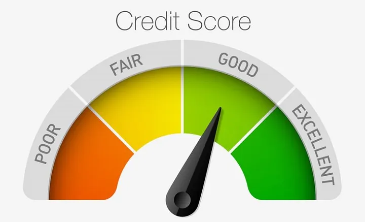
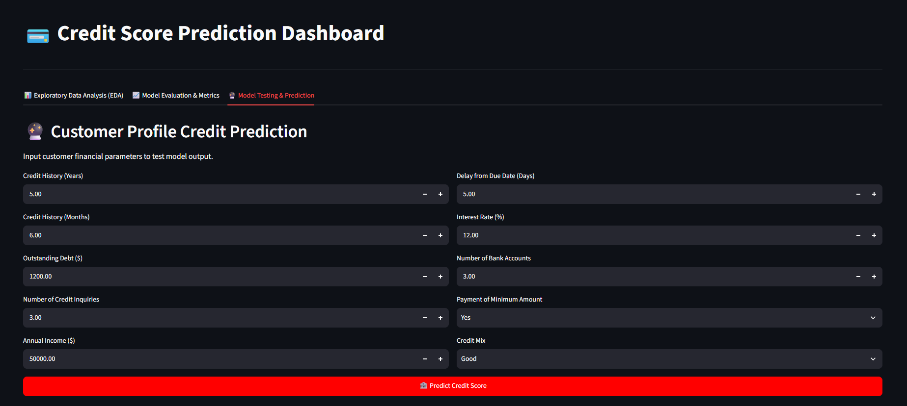

<div align="center">



# 💳 Credit Score Prediction Dashboard

**End-to-end machine learning project: data analysis, feature engineering, and predictive modeling to classify bank customers' credit scores — with an interactive Streamlit dashboard.**

[](https://creditscore-dashboard.streamlit.app/)


[**🚀 Open the Interactive dashboard**](https://creditscore-dashboard.streamlit.app/) &nbsp;&nbsp;|&nbsp;&nbsp; [**📑 View Presentation Slides (PDF)**](credit-score-slides.pdf)

</div>

---

## 📑 Table of Contents

- [Overview](#-overview)
- [Live Demo](#-live-demo)
- [Presentation Slides](#-presentation-slides) [-EC1C24?logo=adobeacrobatreader&logoColor=white)](credit-score-slides.pdf)
- [How to Use the Interactive Model](#-how-to-use-the-interactive-model)
- [Dataset](#-dataset)
- [Methodology](#-methodology)
- [Results](#-results)
- [Project Structure](#-project-structure)
- [Getting Started](#-getting-started)
- [Tech Stack](#-tech-stack)
- [Author](#-author)

---

## 🎯 Overview

A credit score is a numerical rating of a person's creditworthiness, based on their credit history. Lenders use it to measure the **risk of lending money** to someone.

This project builds a classification model that predicts a customer's credit score category — **Good**, **Standard**, or **Poor** — from their banking and payment behavior. It covers the full workflow:

1. Cleaning the data (invalid values, wrong types, outliers, missing values)
2. Engineering new financial ratio features
3. Exploratory data analysis
4. Encoding, scaling, and balancing the data
5. Training and evaluating models
6. Selecting the most important features
7. Deploying everything as an interactive Streamlit app

| Score range | Category |
|:-----------:|:--------:|
| 800 – 850 | Excellent |
| 740 – 799 | Very Good |
| 670 – 739 | Good |
| 580 – 669 | Standard / Fair |
| 300 – 579 | Poor |

---

## 🚀 Live Demo

**👉 [creditscore-dashboard.streamlit.app](https://creditscore-dashboard.streamlit.app/)**

The dashboard has three tabs:

| Tab | What you get |
|-----|--------------|
| 📊 **Exploratory Data Analysis** | 17 interactive Plotly charts (target distribution, boxplots, credit score vs. each feature, credit mix, occupation, month, and more). Pick one from the dropdown, or tick **Show All Charts at Once**. |
| 📈 **Model Evaluation & Metrics** | Confusion matrices (train / test) for the initial model and for the retrained model with the selected features, plus the feature importance chart. |
| 🔮 **Model Testing & Prediction** | Enter a customer profile and get the predicted credit score from the trained Random Forest model. |

<div align="center">



<sub>The <b>Model Testing & Prediction</b> tab</sub>

</div>

> ℹ️ Free Streamlit apps go to sleep after a period of inactivity. If the page shows a "wake up" button, click it and wait a few seconds.

---

## 📊 Presentation Slides

A comprehensive presentation summarizing the business problem, EDA findings, feature importance, and model evaluation is available directly in the repository:

👉 [**Open Presentation Deck (`credit-score-slides.pdf`)**](credit-score-slides.pdf)

---

## 🔮 How to Use the Interactive Model

You can try the trained model directly in your browser — no installation needed.

1. Open the **[live dashboard](https://creditscore-dashboard.streamlit.app/)**.
2. Go to the **🔮 Model Testing & Prediction** tab.
3. Fill in the customer's financial details (see the table below).
4. Click **🏦 Predict Credit Score**.
5. Read the result:
   - 🟢 **Good** — the customer usually pays debts on time
   - 🟡 **Standard** — average payment behavior, sometimes late
   - 🔴 **Poor** — frequent late payments or credit problems

**Inputs**

| Input | Range / options | Default |
|-------|-----------------|:-------:|
| Credit History (Years) | 0 – 60 | 5 |
| Credit History (Months) | 0 – 11 | 6 |
| Outstanding Debt ($) | 0 and above | 1,200 |
| Number of Credit Inquiries | 0 – 50 | 3 |
| Annual Income ($) | 0 and above | 50,000 |
| Delay from Due Date (Days) | 0 – 120 | 5 |
| Interest Rate (%) | 0 – 100 | 12 |
| Number of Bank Accounts | 0 – 30 | 3 |
| Payment of Minimum Amount | Yes / No / Not mentioned | Yes |
| Credit Mix | Good / Standard / Bad / Undetermined | Good |

**What happens behind the scenes**

- Credit history is converted to **months** (`years × 12 + months`).
- **Debt to Income** is calculated automatically: `Outstanding Debt / Annual Income × 100`.
- Categorical inputs are encoded exactly as in training, and numeric inputs are **Min-Max scaled** using the values saved in `scaling_parameters.csv`.
- The processed row is passed to the trained model, which returns the credit score class.

<details>
<summary><b>💻 Use the trained model in your own Python code (click to expand)</b></summary>

<br>

This mirrors what `app.py` does. Run it from the repository folder.

```python
import zipfile
import joblib
import pandas as pd

# 1) Extract and load the model
with zipfile.ZipFile("credit_model.zip") as z:
    name = next(n for n in z.namelist() if n.endswith("credit_model.pkl"))
    with open("credit_model.pkl", "wb") as f:
        f.write(z.read(name))

model = joblib.load("credit_model.pkl")
model = model[0] if isinstance(model, (list, tuple)) else model

# 2) Describe one customer (same order as the training features)
annual_income = 50000
customer = pd.DataFrame([{
    "Credit_History_Age": 5 * 12 + 6,                 # in months
    "Outstanding_Debt": 1200,
    "Num_Credit_Inquiries": 3,
    "Delay_from_due_date": 5,
    "Interest_Rate": 12,
    "Num_Bank_Accounts": 3,
    "Debt_to_Income": 1200 / annual_income * 100,
    "Payment_of_Min_Amount": 2,                       # 0 = Not mentioned, 1 = No, 2 = Yes
    "Credit_Mix": 1,                                  # 0 = Undetermined, 1 = Good, 2 = Standard, 3 = Bad
}])

# 3) Min-Max scale the numeric columns using scaling_parameters.csv
params = pd.read_csv("scaling_parameters.csv")
numeric_cols = ["Outstanding_Debt", "Num_Credit_Inquiries", "Delay_from_due_date",
                "Interest_Rate", "Num_Bank_Accounts", "Debt_to_Income", "Credit_History_Age"]

for i, col in enumerate(numeric_cols):
    if "feature" in params.columns:
        row = params[params["feature"] == col].iloc[0]
        c_min, c_max = float(row["min"]), float(row["max"])
    else:
        c_min, c_max = float(params["min"].iloc[i]), float(params["max"].iloc[i])
    customer[col] = (customer[col] - c_min) / ((c_max - c_min) or 1.0)

# 4) Predict
print(model.predict(customer)[0])   # -> Good / Standard / Poor
```

</details>

> ⚠️ **Note:** only load `.pkl` files from sources you trust — pickle files can execute code when loaded.

---

## 🗂 Dataset

| Item | Value |
|------|-------|
| Labeled rows | 100,000 |
| Unlabeled rows (dropped) | 50,000 |
| Target | `Credit_Score` → Good / Standard / Poor |

**Target distribution (unbalanced):**

| Class | Count |
|-------|------:|
| Good | 17,828 |
| Standard | 53,174 |
| Poor | 28,998 |

**Main columns:** delay from due date, type of loan, number of bank accounts, number of credit cards, number of loans, credit history age, payment of minimum amount, interest rate, outstanding debt, annual income, monthly in-hand salary, monthly balance, amount invested monthly, and more.

**Unimportant columns (not used):** `Name`, `ID`, `Customer_ID`.

---

## 🔬 Methodology

### 1. Data Cleaning

**Invalid values**

| Column | Invalid value | Replaced with |
|--------|---------------|---------------|
| Occupation | `_______` | `undetermined occupation` |
| Credit mix | `_` | `undetermined credit mix` |
| Payment behavior | `!@9#%8` | `Undefined behavior` |

**Type correction** — these columns were stored as strings and converted to numeric: outstanding debt, age, annual income, number of delayed payments, changed credit limit, number of loans, monthly balance, amount invested monthly.

**Outliers**

| Column | Outliers | Treatment |
|--------|---------:|-----------|
| Age | 2.781% | Values `< 21` or `> 69` replaced with the median (33) |
| Outstanding debt | 5.272% | Max outlier (5,000) is an acceptable deviation |

**Missing values** — 62,162 in total. Numerical columns are filled with the **median**, categorical columns with the **mode**.

### 2. Feature Engineering

| Feature | Formula |
|---------|---------|
| EMI to Income Ratio | `total EMI per month / monthly in-hand salary × 100` |
| Debt to Income | `outstanding debt / annual income × 100` |
| Invested to Income Ratio | `amount invested monthly / monthly in-hand salary × 100` |
| Balance to Income Ratio | `monthly balance / monthly in-hand salary × 100` |

For Debt to Income: **< 30%** is good, **30–50%** is not bad, **> 50%** is risky.

### 3. Exploratory Data Analysis

Analysis of 14 numerical features and 4 categorical features (type of loan, credit mix, payment behaviour, payment of minimum amount) against the credit score. All charts are available in the dashboard.

### 4. Encoding & Scaling

<details>
<summary><b>Encoding maps (click to expand)</b></summary>

<br>

**Credit mix**

| Value | Code |
|-------|:----:|
| Undetermined credit mix | 0 |
| Good | 1 |
| Standard | 2 |
| Bad | 3 |

**Payment behaviour**

| Value | Code |
|-------|:----:|
| Undefined behaviour | 0 |
| High spent large value payment | 1 |
| High spent medium value payment | 2 |
| High spent small value payment | 3 |
| Low spent large value payment | 4 |
| Low spent medium value payment | 5 |
| Low spent small value payment | 6 |

**Payment of min amount**

| Value | Code |
|-------|:----:|
| NM (not mentioned) | 0 |
| No | 1 |
| Yes | 2 |

**Type of loan** — encoded per loan type (student, personal, debt consolidation, home equity, payday, credit builder, auto, mortgage, not specified).

</details>

All numerical features are **normalized** (Min-Max scaling) before modeling.

### 5. Modeling

- **Balancing:** under-sampling to handle the unbalanced target
- **Split:** 80% training / 20% testing
- **Models:** Random Forest and Logistic Regression
- **Random Forest tuning:** `n_estimators = 150`, `max_depth = 13`, Stratified K-Fold with `n_splits = 5`

### 6. Feature Importance

Features with importance **below 0.04** were dropped. The final **9 features**, ranked:

1. Credit history age
2. Outstanding debt
3. Number of credit inquiries
4. Delay from due date
5. Interest rate
6. Number of bank accounts
7. Debt to income
8. Payment of minimum amount
9. Credit mix

---

## 📈 Results

| Model | Accuracy |
|-------|:--------:|
| **Random Forest** | **76%** |
| Logistic Regression | 66% |

**Random Forest performance**

| Feature set | Train accuracy | Test accuracy |
|-------------|:--------------:|:-------------:|
| All features | 80% | 75% |
| **9 selected features** | **80%** | **76%** |

Using only the 9 selected features slightly improved test accuracy while making the model simpler.

**Per-class recall on the test set (9 selected features)**

| Good | Poor | Standard |
|:----:|:----:|:--------:|
| 0.85 | 0.81 | 0.61 |

The **Standard** class is the hardest to predict, since it sits between Good and Poor.

---

## 📁 Project Structure

```
Credit-Score-Dashboard/
├── app.py                      # Streamlit app (EDA, evaluation, interactive model)
├── credit_score-dataset.zip    # Bank Credit Score Dataset
├── credit_model.zip            # Trained Random Forest model (extracted automatically on first run)
├── credit-score-slides.pdf     # Presentation Slides
├── scaling_parameters.csv      # Min / Max of each numeric feature, used to scale user input
├── feature_importance.pkl      # Saved Plotly figure: feature importance
├── credit1.pkl … credit22.pkl  # Saved Plotly figures (EDA charts and confusion matrices)
├── requirements.txt            # Python dependencies
├── assets/                     # Images used in this README
│   ├── credit_score_gauge.png
│   └── dashboard_prediction.png
└── README.md
```

**What the saved charts contain**

| Files | Content |
|-------|---------|
| `credit1.pkl` – `credit17.pkl` | EDA charts shown in the **EDA** tab |
| `credit18.pkl`, `credit19.pkl` | Testing / training confusion matrices (initial model) |
| `feature_importance.pkl` | Feature importance chart |
| `credit21.pkl`, `credit22.pkl` | Testing / training confusion matrices (retrained on selected features) |

---

## ⚙️ Getting Started

### Prerequisites

- Python 3.9 or higher
- `pip`

### Installation

```bash
# 1. Clone the repository
git clone https://github.com/Mohammed-Nasr-Aldin/Credit-Score-Dashboard.git
cd Credit-Score-Dashboard

# 2. (Optional) create a virtual environment
python -m venv venv
source venv/bin/activate        # Windows: venv\Scripts\activate

# 3. Install the dependencies
pip install -r requirements.txt
```

### Run the app

```bash
streamlit run app.py
```

Then open the local URL shown in the terminal (usually `http://localhost:8501`).

### Good to know

- The first time the app runs, it extracts `credit_model.pkl` from `credit_model.zip` automatically.
- The charts are saved Plotly figures. If a chart shows a *"Plotly version mismatch"* warning, install the same Plotly version listed in `requirements.txt`.

---

## 🧰 Tech Stack

- **Language:** Python
- **Data:** pandas, NumPy
- **Modeling:** scikit-learn (Random Forest, Logistic Regression), joblib
- **Visualization:** Plotly
- **App:** Streamlit

---

## 👤 Author

**Mohamed Nasr Eldin**

[](https://github.com/Mohammed-Nasr-Aldin)

If you found this project useful, consider giving it a ⭐ on GitHub!
